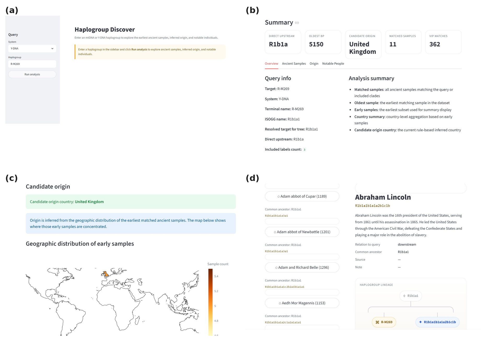

# Haplogroup Discover 🧬

**Haplogroup Discover** is a bioinformatics tool that takes an mtDNA or Y-DNA haplogroup as input and returns:
- The **earliest ancient samples** from the AADR dataset that carry that lineage
- A **candidate geographic origin** inferred from where those early samples cluster
- **Notable historical individuals** (kings, scientists, famous figures) who share the same genetic lineage

It ships with both a **Streamlit web interface** and a **command-line interface (CLI)**.

---

## Table of Contents

- [Background](#background)
- [Methodology](#methodology)
- [Project Structure](#project-structure)
- [Files Included](#files-included)
- [Installation](#installation)
- [How to Run](#how-to-run)
- [Common Questions (FAQ)](#common-questions-faq)
- [Known Bugs and Limitations](#known-bugs-and-limitations)
- [FAIR](#FAIR)

---

## Background

Human haplogroups are branches of a global genealogical tree defined by mutations in mitochondrial DNA (mtDNA, inherited maternally) or the Y chromosome (Y-DNA, inherited paternally). By comparing a haplogroup query against ancient DNA records, we can trace when and where that lineage first appears in the archaeological record and which historical figures may share it.

This project integrates:
- The **Allen Ancient DNA Resource (AADR)** — a curated database of ancient human genomes
- Established **phylogenetic trees** for mtDNA (PhyloTree build 17) and Y-chromosome (ISOGG 2016)
- A curated **VIP dataset** of notable individuals with known haplogroups

---

## Methodology

### 1. Haplogroup resolution

When a user enters a haplogroup label (e.g. `R-M269` or `U5b2c`), the tool first resolves it against the relevant phylogenetic tree:

- **mtDNA**: The label is looked up directly in the PhyloTree file.
- **Y-DNA**: Labels in the AADR use terminal SNP format (e.g. `R-M269`) while the tree uses ISOGG hierarchical format (e.g. `R1b1a1`). The tool resolves this by:
  1. Checking if the raw label exists in the tree
  2. Consulting a pre-built alias table (`y_aliases.tsv`)
  3. Mapping AADR terminal → ISOGG via the AADR dataset itself
  4. Walking up by prefix truncation as a last-resort fallback

### 2. Clade expansion

Once the target node is found in the tree, the tool collects:
- The **direct upstream (parent)** node
- All **downstream (descendant)** nodes (full subtree)
- The **target** itself

This set of labels is then converted back to AADR-style terminal names for sample matching.

### 3. Ancient sample matching

AADR rows whose haplogroup column (`mt_haplogroup` or `y_haplogroup`) is in the resolved label set are selected. Samples are sorted by `date_mean_bp` (years before present, descending) so the oldest appear first.

### 4. Origin inference

The **N earliest** samples (default N = 5, configurable via `--early-n`) are used to build a country-level summary. The country with the most early samples — with ties broken by the oldest sample date — is returned as the **candidate origin country**.

> ⚠️ This is a heuristic. Ancient DNA sampling coverage is geographically uneven; the inferred origin reflects data availability as much as true geographic origin.

### 5. VIP matching

Each entry in the VIP dataset is compared to the query haplogroup. For each VIP, the relationship is classified as:

| Relation | Meaning |
|---|---|
| `exact` | VIP carries the exact same haplogroup |
| `downstream` | VIP's haplogroup is a sub-clade of the query |
| `upstream` | VIP's haplogroup is an ancestor of the query |
| `related` | Same major clade but no direct ancestor/descendant link (mtDNA only) |

For Y-DNA queries, only `downstream` matches are shown (VIPs who descend from the queried lineage). For mtDNA, all related matches are shown.

---

## Project Structure

```
project_fixed/
├── README.md                  # This file
├── requirements.txt           # Python dependencies
│
├── data/
│   ├── aadr/
│   │   └── AADR Annotations 2025.xlsx   # Ancient DNA dataset
│   ├── trees/
│   │   ├── mt_phyloTree_b17_Tree2.txt   # mtDNA phylogenetic tree
│   │   └── chrY_hGrpTree_isogg2016.txt  # Y-chromosome tree (ISOGG 2016)
│   ├── vip/
│   │   └── VIPHaplogroups.xlsx          # Notable individuals dataset
│   └── y_aliases.tsv                    # Y-DNA label alias mapping table
│
├── images/
│   └── haplogroup_figure_2x2.png        # Screenshot figure for the paper
│
└── src/
    ├── app.py               # Streamlit web UI (entry point for web mode)
    ├── main.py              # CLI entry point
    ├── config.py            # Centralised path configuration
    ├── service.py           # Pipeline orchestrator (used by app.py)
    ├── analysis_origin.py   # Origin + ancient sample analysis logic
    ├── analysis_vip.py      # VIP matching analysis logic
    ├── tree_parser.py       # Phylogenetic tree loader and traversal
    ├── aadr_parser.py       # AADR Excel/TSV loader and column normaliser
    ├── vip_parser.py        # VIP Excel loader and column normaliser
    ├── vip_matcher.py       # Haplogroup relationship classifier
    ├── y_mapper.py          # Y-DNA label resolution utilities
    └── export_y_aliases.py  # Utility to regenerate y_aliases.tsv
```

---

## Files Included

| File | Description |
|---|---|
| `data/aadr/AADR Annotations 2025.xlsx` | Ancient DNA metadata from the Allen Ancient DNA Resource (v54.1). Contains sample IDs, haplogroups, dates, and geographic locations for thousands of ancient individuals. |
| `data/trees/mt_phyloTree_b17_Tree2.txt` | mtDNA phylogenetic tree in `child parent` format, from PhyloTree Build 17. |
| `data/trees/chrY_hGrpTree_isogg2016.txt` | Y-chromosome haplogroup tree in `child parent` format, from ISOGG 2016. |
| `data/vip/VIPHaplogroups.xlsx` | Curated list of notable historical individuals with their haplogroups. Contains separate sheets for Y-DNA (`Y`) and mtDNA (`mtDNA`). |
| `data/y_aliases.tsv` | A mapping table with columns `raw_label`, `aadr_isogg`, `tree_label` used to bridge label format differences between AADR and the Y tree. |
| `requirements.txt` | Lists all Python packages required to run the project. |

---

## Installation

### Requirements

- Python **3.10 or higher**

### Step 1 — Clone the repository

```bash
git clone https://github.com/shushu0305/population-project.git
cd population-project
```

### Step 2 — Install dependencies

I use minimum version constraints rather than exact version pinning, which makes the environment less restrictive. However, the main risk of using minimum version constraints is that future package versions, especially major releases, may introduce breaking API changes or change default behaviour. To reduce the risk, the minimum versions should be reviewed periodically.
```bash
pip install -r requirements.txt
```

---

## How to Run

All commands below assume you are in the **`src/`** directory:

```bash
cd src
```

### Web Interface (Streamlit)

```bash
streamlit run app.py
```

The app will open in your browser at `http://localhost:8501`.

**Usage:**
1. Select **Y-DNA** or **mtDNA** from the sidebar dropdown.
2. Type a haplogroup label (e.g. `R-M269`, `U5b2c`, `H1a`).
3. Click **Run analysis**.
4. Explore tabs: **Overview**, **Ancient Samples**, **Origin**, **Notable People**.


---

### Command-Line Interface

```bash
# mtDNA example
python main.py --system mt --target U5b2c --aadr "../data/aadr/AADR Annotations 2025.xlsx"

# Y-DNA example, save results to files
python main.py \
  --system y \
  --target R-M269 \
  --aadr "../data/aadr/AADR Annotations 2025.xlsx" \
  --vip ../data/vip/VIPHaplogroups.xlsx \
  --early-n 10 \
  --save
```

---

## Common Questions (FAQ)

**Q: My haplogroup returns no matched samples.**  
A: The label may not resolve against the phylogenetic tree, or no AADR samples carry that clade. Try a parent clade (e.g. `U5b` instead of `U5b2c1a`). For Y-DNA, try both the ISOGG-style label (e.g. `R1b1a1`) and the terminal SNP format (e.g. `R-M269`).

**Q: The candidate origin country seems wrong.**  
A: Origin inference is a heuristic based on the oldest known ancient samples. AADR coverage is biased toward Europe and West Asia, so results reflect sampling density as much as true geographic origin.

**Q: No VIP matches are shown.**  
A: For Y-DNA, only *downstream* matches are returned. If the query is already a very specific sub-clade, there may be no known VIPs further downstream. For mtDNA, upstream and related matches are also included.

**Q: Can I use a custom VIP dataset?**  
A: Yes. Create an Excel file with at least two columns: one for the person's name (labelled `Individual`, `Name`, or `VIP`) and one for their haplogroup (labelled `Haplogroup`, `HG`, or `mtDNA`). Pass it via `--vip` on the CLI, or update `VIP_PATH` in `app.py`.

**Q: What is `date_mean_bp`?**  
A: Years Before Present (BP), where "present" is defined as 1950 CE. A value of `5000` means approximately 3050 BCE.

---

## Known Bugs and Limitations


### 1. Origin inference is biased by sampling coverage
The AADR dataset has far more ancient samples from Europe and the Middle East than from Africa, East Asia, or the Americas. Haplogroups with true origins outside well-sampled regions may return misleading candidate countries.

### 2. Y-DNA resolution can silently fall back to a prefix ancestor
If a Y-DNA label is not found in the ISOGG 2016 tree (e.g. it was defined after 2016), the tool trims characters from the end of the label until a matching ancestor node is found. The resolved node is shown in the UI as "Resolved target for tree" — always check this field to confirm the resolution makes sense.


## FAIR

### Findable
The metadata could be found by both human and computer. Metadata(AADR dataset in data folder) is registered and indexed in database(a open resources database of human DNA information)
### Accessible
The protocal is open, free and universally implementable. The project was uploaded in Github repository and it's public.
### Interoperable
Metadtata uses formal formats(csv and txt); Users not only can get results from online website, but also can download them as csv file, which can be integrated with other data, applications, or workflows.
### Reusable
It has clear workflow in README and LICENSE, also gives a briefly introduction on AADR and haplogroups.
